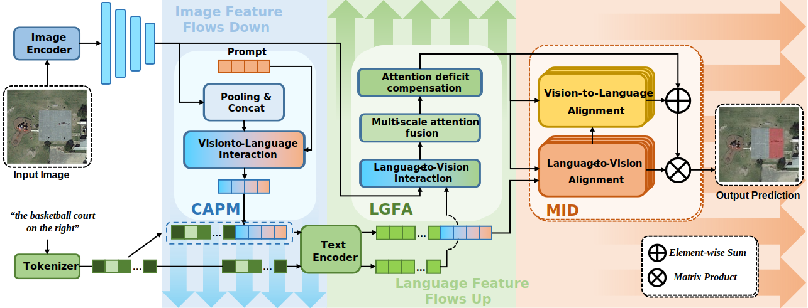
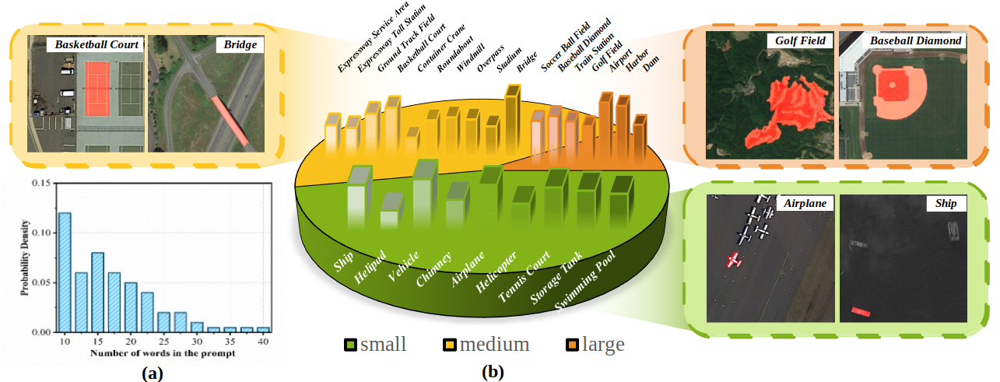

<h1 align="center"> Cross-Modal Bidirectional Interaction Model for Referring Remote Sensing Image Segmentation </h1>

<h4 align="center">
    <a href="https://scholar.google.com/citations?user=6ygNEFsAAAAJ&hl=zh-CN">Zhe Dong</a><sup>1</sup>,
    <a href="https://github.com/">Yuzhe Sun</a><sup>1</sup>,
    <a href="https://scholar.google.com/citations?user=WHkRZscAAAAJ&hl=zh-TW&oi=ao">Yanfeng Gu</a><sup>1</sup>    
    <a href="https://www.researchgate.net/profile/Tianzhu-Liu-3">Tianzhu Liu</a><sup>1</sup>,

</h4>
<ul align="center">
  <sup>1</sup>Harbin Institute of Technology</li>
</ul>

<h5 align="center">

[](https://arxiv.org/abs/2410.06811)

## 🗓️ TODO
- [ ] Release code and models of our methods.
- [x] **[2024.10.11]** We release the RISBench, a large-scale Vision-Language Benchmark for Referring Remote Sensing Image Segmentation. 


## 📖 Abstract
<center>
    
</center>
Given a natural language expression and a remote sensing image, the goal of referring remote sensing image segmentation (RRSIS) is to generate a pixel-level mask of the target object identified by the referring expression. In contrast to natural scenarios, expressions in RRSIS often involve complex geospatial relationships, with target objects of interest that vary significantly in scale and lack visual saliency, thereby increasing the difficulty of achieving precise segmentation. To address the aforementioned challenges, a novel RRSIS framework is proposed, termed the cross-modal bidirectional interaction model (CroBIM). Specifically, a context-aware prompt modulation (CAPM) module is designed to integrate spatial positional relationships and task-specific knowledge into the linguistic features, thereby enhancing the ability to capture the target object. Additionally, a language-guided feature aggregation (LGFA) module is introduced to integrate linguistic information into multi-scale visual features, incorporating an attention deficit compensation mechanism to enhance feature aggregation. Finally, a mutual-interaction decoder (MID) is designed to enhance cross-modal feature alignment through cascaded bidirectional cross-attention, thereby enabling precise segmentation mask prediction. To further forster the research of RRSIS, we also construct RISBench, a new large-scale benchmark dataset comprising 52,472 image-language-label triplets. Extensive benchmarking on RISBench and two other prevalent datasets demonstrates the superior performance of the proposed CroBIM over existing state-of-the-art (SOTA) methods.

## 📗Datasets
<center>
    
</center>

RISBench is a large-scale Vision-Language Benchmark for Referring Remote Sensing Image Segmentation. It comprises 52,472 high-quality image-language label triplets. Each image in RISBench is uniformly sized at 512x512 pixels, maintaining consistency across the dataset. The spatial resolution of the images spans from 0.1m to 30m, encompassing a diverse range of scales and details. The semantic labels are categorized into 26 distinct classes, each annotated with 8 attributes, thereby facilitating a comprehensive and nuanced semantic segmentation analysis. 

The dataset can be downloaded from [Baidu Netdisk](https://pan.baidu.com/s/1TniZrKqa2BBGvZ5sJAnsAw?pwd=wnxg) (access code: wnxg).

## 🍺 Visualizations
<center>
    
</center>


## ❤️Licensing Information
The dataset is released under the [CC-BY-4.0]([https://creativecommons.org/licenses/by-nc/4.0/deed.en](https://creativecommons.org/licenses/by/4.0/deed.en)), which permits unrestricted use, distribution, and reproduction in any medium, provided the original work is properly cited.

## 📜 Citation
if you find it helpful, please cite
```bibtex
@article{li2024vrsbench,
  title={VRSBench: A Versatile Vision-Language Benchmark Dataset for Remote Sensing Image Understanding},
  author={Xiang Li, Jian Ding, and Mohamed Elhoseiny},
  journal={arXiv:2406.12384},
  year={2024}
}
```

## 🙏 Acknowledgement
Our VRSBench dataset is built based on [VRSBench](https://https://github.com/lx709/VRSBench), [DOTA-v2](https://captain-whu.github.io/DOTA/dataset.html) and [DIOR](https://gcheng-nwpu.github.io/#Datasets) datasets.

We are thankful to [LAVT](https://github.com/yz93/LAVT-RIS), and [RMSIN](https://github.com/Lsan2401/RMSIN) for releasing their models and code as open-source contributions.

